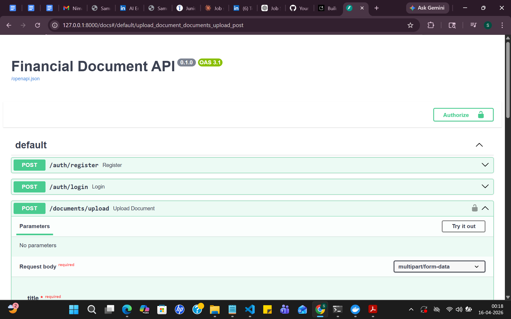
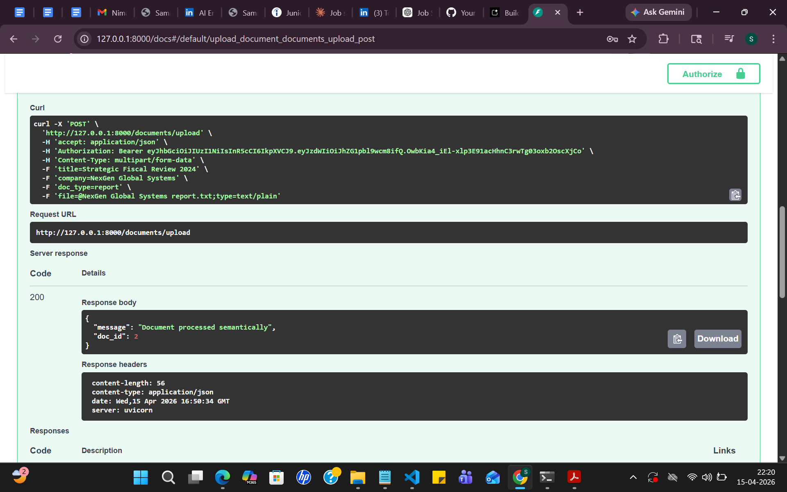
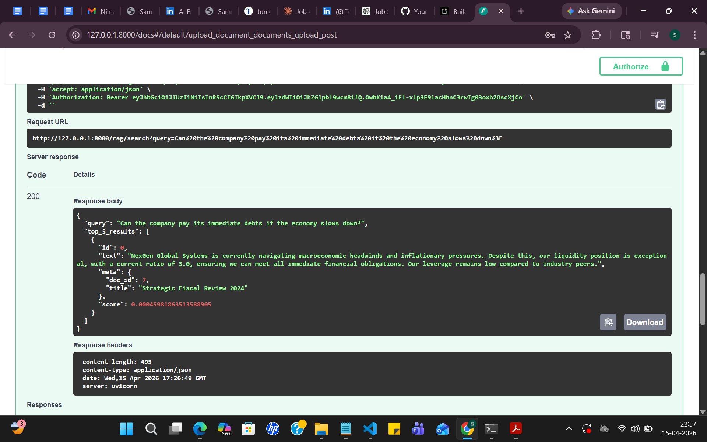

# 📊 Financial Document Management with AI-Powered RAG

## 🚀 Overview
A production-ready Financial Document Management API built with **FastAPI**. It features a **Two-Stage Retrieval-Augmented Generation (RAG)** pipeline designed to provide high-accuracy semantic search over financial reports, invoices, and agreements.

## 🧠 AI Architecture 
Unlike basic vector search systems, this project implements a **Two-Stage Retrieval Architecture**:
1.  **Stage 1 (Retrieval):** Uses **FAISS** (Facebook AI Similarity Search) with `all-MiniLM-L6-v2` embeddings to fetch the top 20 candidate chunks.
2.  **Stage 2 (Reranking):** Uses **FlashRank** (Cross-Encoder) to re-evaluate those candidates, ensuring the final top 5 results are contextually and financially relevant.
*This approach handles the nuance of financial terminology (e.g., mapping "immediate debts" to "short-term obligations") significantly better than simple keyword matching.*

## 🛠️ Tech Stack
- **Backend:** FastAPI (Asynchronous)
- **AI/RAG:** LangChain, FAISS, Sentence-Transformers, FlashRank.
- **Security:** JWT Authentication + **Role-Based Access Control (RBAC)**.
- **Database:** SQLite with SQLAlchemy ORM for metadata storage.
- **DevOps:** Docker, Docker-Compose.

## 🛡️ Security & Roles
The system implements strict RBAC via FastAPI dependencies:
- **Admin:** Full access to all systems.
- **Financial Analyst:** Can upload and analyze documents.
- **Auditor/Client:** Read-only access to specific search and retrieval endpoints.

## 🐳 Deployment (DevOps)
As a Cloud DevOps professional, I have ensured the application is fully containerized.

### Using Docker
1. Build the image:
   ```bash
   docker build -t finance-ai-app .

## 📍 API Endpoints Mapping (Requirement Checklist)
| Method | Endpoint | Description | Role Required |
|--------|----------|-------------|---------------|
| POST | `/auth/register` | Register new user | Public |
| POST | `/auth/login` | Get JWT Access Token | Public |
| POST | `/documents/upload` | Upload & Index Doc | Admin/Analyst |
| GET | `/documents` | List all metadata | All Authenticated |
| POST | `/rag/search` | Semantic Search + Rerank | All Authenticated |

## 🛠️ Performance Fixes Implemented
- **Bcrypt Conflict:** Switched to PBKDF2 for stable Windows/Linux cross-compatibility.
- **Numpy Serialization:** Handled custom float32 casting for standard JSON responses.
- **Vector ID Handling:** Integrated UUID4 for robust indexing in local vector storage.

## 📸 Project Demo (Screenshots)
| API Overview | Document Upload | Semantic Search Result |
|--------------|-----------------|------------------------|
|  |  |  |
