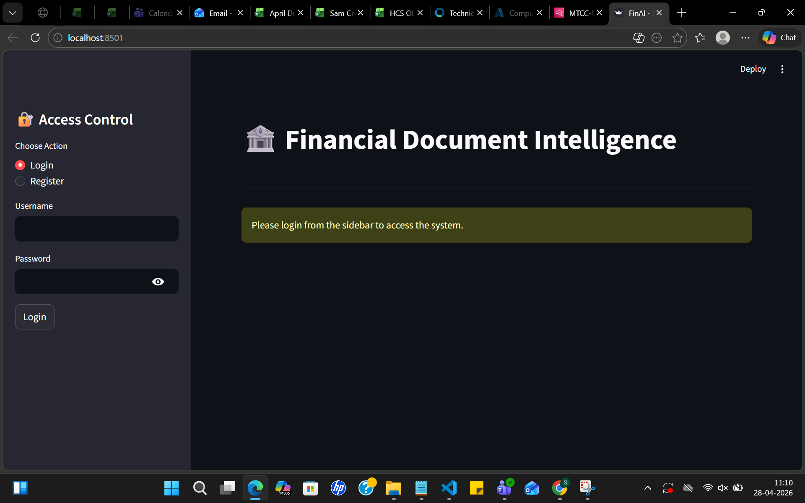
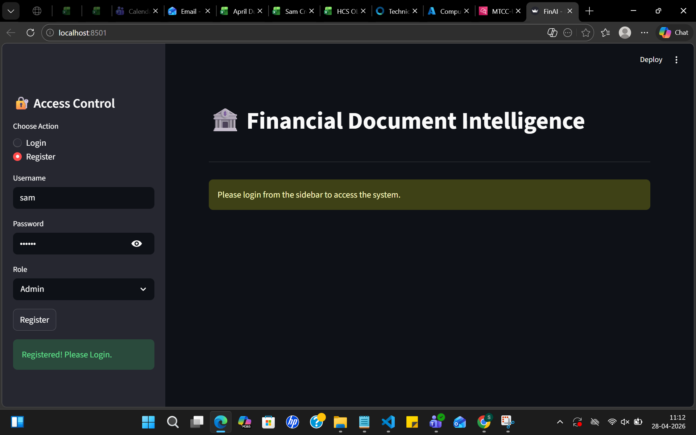

# 🏦 FinAI: Retrieval-Augmented Financial Document Intelligence Platform

## 🚀 Overview

**FinAI** is a production-ready **Agentic Retrieval-Augmented Generation (RAG)** platform designed to enable intelligent querying of unstructured financial documents using semantic search and embedding-based retrieval.

The system allows analysts to securely upload reports and perform **context-aware financial intelligence extraction** using a two-stage retrieval architecture combining vector similarity search and semantic reranking.

Unlike traditional keyword-based systems, FinAI improves answer accuracy by grounding responses in retrieved document knowledge instead of relying only on language model memory.

---

## 📸 Intelligence Dashboard (UI Demo)

| Feature | Screenshot |
|--------|------------|
| Main AI Dashboard |  |
| Registration & RBAC |  |
| Document Indexing |  |
| Semantic Search Result |  |

---

## 🧠 AI Architecture Pipeline

This platform implements a **two-stage semantic retrieval pipeline** optimized for financial document intelligence.

### Stage 1 — Vector Retrieval (Bi-Encoder)

Financial documents are:

1. Parsed  
2. Cleaned  
3. Chunked  
4. Converted into embeddings using:

```
sentence-transformers/all-MiniLM-L6-v2
```

Embeddings are stored inside:

```
FAISS Vector Database
```

FAISS performs fast semantic similarity matching to retrieve top-k relevant document chunks.

---

### Stage 2 — Semantic Reranking (Cross-Encoder)

Retrieved chunks are reranked using:

```
FlashRank (ms-marco-MiniLM-L-12-v2)
```

This improves:

- contextual relevance
- precision
- semantic understanding
- financial document retrieval accuracy

This hybrid pipeline significantly reduces hallucination risk compared to single-stage retrieval systems.

---

## ⚙️ End-to-End Workflow

System execution pipeline:

```
Document Upload
      ↓
Text Extraction
      ↓
Chunking
      ↓
Embedding Generation
      ↓
Vector Storage (FAISS)
      ↓
Semantic Retrieval
      ↓
Cross-Encoder Reranking
      ↓
Context-Aware Response Generation
```

---

## 🛠️ Tech Stack

### Backend

- FastAPI (Asynchronous high-performance backend)
- JWT Authentication
- REST API architecture

### Frontend

- Streamlit Intelligence Dashboard

### AI / NLP Stack

- Sentence Transformers
- FAISS Vector Search
- FlashRank Cross-Encoder Reranking
- Semantic Chunking Pipeline

### Database Layer

- SQLite
- SQLAlchemy ORM

Used for:

- metadata storage
- authentication management
- RBAC enforcement

### Security Layer

- JWT Authentication
- Role-Based Access Control (RBAC)

---

## 🔐 Role-Based Access Control (RBAC)

Secure access architecture implemented using FastAPI dependency injection.

Supported roles:

**Admin**

Full system access

**Financial Analyst**

Upload  
Index  
Search  
Analyze documents

**Auditor / Client**

Read-only semantic search access

---

## 🚀 Key Features

- Retrieval-Augmented Generation (RAG) architecture
- FAISS vector similarity search engine
- Cross-encoder semantic reranking pipeline
- Financial document intelligence querying
- Secure JWT authentication
- Role-Based Access Control (RBAC)
- Streamlit interactive dashboard
- Metadata indexing using SQLAlchemy
- Docker containerized deployment support

---

## 🐳 Deployment

### Docker Deployment

```
docker build -t finance-ai-app .
docker-compose up
```

---

### Local Development Setup

Install dependencies:

```
pip install -r requirements.txt
```

Run backend server:

```
python main.py
```

Run dashboard:

```
streamlit run ui.py
```

---

## 📡 API Endpoints

| Method | Endpoint | Description | Role Required |
|-------|----------|-------------|--------------|
| POST | /auth/register | Register new user | Public |
| POST | /auth/login | Generate JWT token | Public |
| POST | /documents/upload | Upload & index document | Admin / Analyst |
| GET | /documents | Retrieve metadata | Authenticated |
| POST | /rag/search | Semantic search pipeline | Authenticated |

---

## ⚡ Performance Engineering Improvements

Implemented production-oriented fixes:

- Replaced bcrypt with PBKDF2 for cross-platform stability
- Optimized NumPy serialization handling for API responses
- UUID4-based vector indexing for consistent retrieval mapping
- Async FastAPI request handling for scalability

---

## 📊 System Design Highlights

This project demonstrates:

✔ Retrieval-Augmented Generation architecture  
✔ Vector database integration  
✔ Embedding pipelines  
✔ Semantic reranking  
✔ Secure AI application deployment  
✔ Production-style backend engineering  
✔ Applied NLP system design  

---

## 🎯 Recruiter Evaluation Note

This project represents an end-to-end implementation of a secure **production-style Generative AI pipeline**, combining:

- Machine Learning
- Semantic Retrieval
- Backend Engineering
- Authentication Systems
- Vector Databases
- Interactive Dashboards

It demonstrates the ability to convert AI research workflows into deployable intelligent software systems.
